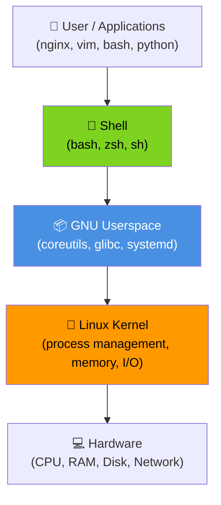
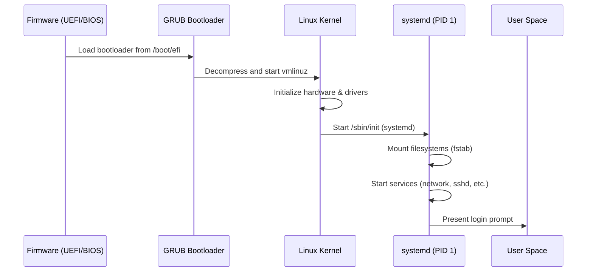
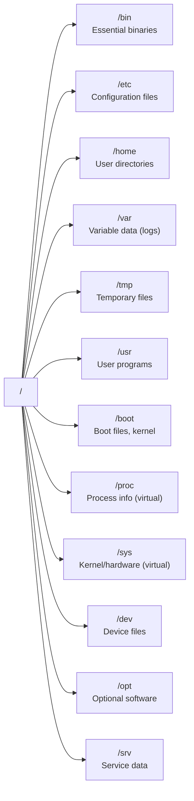

# Module 1: Linux and Ubuntu Fundamentals

**Duration:** 30 minutes  
**Difficulty:** Beginner

---

## Learning Objectives

By the end of this module you will be able to:

- Explain the Linux architecture and the role of the kernel, shell, and GNU userspace
- Describe the Ubuntu Server 24.04 boot process
- Navigate the Linux directory hierarchy (FHS)
- Explain the difference between `root` and `sudo`
- Identify system information using `hostnamectl`, `uname`, and `cat /etc/os-release`

---

## 1. Why Linux?

Linux powers **over 90% of the world's servers**, all Android phones, most cloud infrastructure, and every supercomputer in the Top500. As an IT professional, Linux administration is a foundational skill.

Ubuntu Server 24.04 LTS (Noble Numbat) is the enterprise-grade Linux distribution used in this workshop. LTS means **Long Term Support** — it receives security updates until **April 2029**.

---

## 2. Linux Architecture

Linux is not one program — it is a layered system where each layer has a specific job.



| Layer | What it does | Examples |
|-------|-------------|---------|
| **Hardware** | Physical resources | CPU, RAM, NIC, SSD |
| **Kernel** | Manages hardware, provides system calls | `linux-image-6.8.0` |
| **GNU Userspace** | Tools and libraries that programs depend on | `coreutils`, `glibc`, `systemd` |
| **Shell** | Command interpreter — your interface to the OS | `bash`, `zsh` |
| **Applications** | Software that runs on top | `nginx`, `vim`, `python3` |


**Key insight:** When you type a command like `ls`, your shell sends it to the GNU coreutils binary, which calls kernel system calls to read the filesystem — all in milliseconds.


---

## 3. The Linux Boot Process

Understanding how Ubuntu starts gives you power to troubleshoot startup failures.




If the system fails to boot, boot error messages appear during the **kernel** or **systemd** stage. Always check `journalctl -b -1` (previous boot) or `systemctl --failed` after login.


---

## 4. The Linux Directory Hierarchy (FHS)

Everything in Linux is a file — and every file has a home. The **Filesystem Hierarchy Standard (FHS)** defines where things live.



| Directory | Purpose |
|-----------|---------|
| `/` | Root — top of the tree |
| `/bin`, `/usr/bin` | Executable programs (ls, cp, grep) |
| `/etc` | System-wide configuration |
| `/home` | User home directories |
| `/var/log` | System and application logs |
| `/tmp` | Temporary files (cleared on reboot) |
| `/proc` | Virtual: live process/kernel info |
| `/sys` | Virtual: hardware/driver info |
| `/dev` | Device files (disks, terminals) |
| `/boot` | Kernel and bootloader files |
| `/opt` | Third-party optional software |


**Windows vs Linux:** In Windows you have `C:\Users\Alice\Documents`. In Linux you have `/home/alice/documents`. No drive letters — one unified tree starting at `/`.


---

## 5. root vs sudo

| Concept | Explanation |
|---------|------------|
| **root** | The superuser — UID 0. Has absolute power over the system. |
| **sudo** | "Substitute User DO" — lets a regular user run ONE command as root. |
| **sudoers** | Configuration file `/etc/sudoers` that defines who can use sudo. |

**Why not just use root?** Accountability, auditability, and safety. Every `sudo` command is logged in `/var/log/auth.log`.

---

## 🔬 Lab 1: Exploring Your Ubuntu System

**Estimated time:** 20 minutes

### Objectives
- SSH into the server (or use the terminal below)
- Identify the OS version and hostname
- Explore the filesystem root
- Locate the kernel version
- Check your user identity
- Practice using sudo

---

### Step 1: Check Your Current User

Before doing anything, always know WHO you are on the system.

```terminal:execute
command: whoami
```

Expected output:
```
student
```

Now get full user details including groups:

```terminal:execute
command: id
```

Expected output:
```
uid=1000(student) gid=1000(student) groups=1000(student),4(adm),27(sudo),1000(student)
```

> The `sudo` group means this user can run commands with elevated privileges.

---

### Step 2: Identify the Operating System

Always verify what OS version you're on before making changes.

```terminal:execute
command: cat /etc/os-release
```

Expected output:
```
PRETTY_NAME="Ubuntu 24.04.1 LTS"
NAME="Ubuntu"
VERSION_ID="24.04"
VERSION="24.04.1 LTS (Noble Numbat)"
ID=ubuntu
ID_LIKE=debian
HOME_URL="https://www.ubuntu.com/"
SUPPORT_URL="https://help.ubuntu.com/"
BUG_REPORT_URL="https://bugs.launchpad.net/ubuntu/"
PRIVACY_POLICY_URL="https://www.ubuntu.com/legal/terms-and-policies/privacy-policy"
UBUNTU_CODENAME=noble
LOGO=ubuntu-logo
```

---

### Step 3: Check the Hostname

The hostname identifies this machine on the network.

```terminal:execute
command: hostnamectl
```

Expected output:
```
 Static hostname: ubuntu-server
       Icon name: computer-vm
         Chassis: vm 🖥️
      Machine ID: a1b2c3d4e5f6a7b8c9d0e1f2a3b4c5d6
         Boot ID: f1e2d3c4b5a6f7e8d9c0b1a2f3e4d5c6
  Operating System: Ubuntu 24.04.1 LTS
            Kernel: Linux 6.8.0-45-generic
      Architecture: x86-64
   Hardware Vendor: QEMU
    Hardware Model: Standard PC (Q35 + ICH9, 2009)
  Firmware Version: 1.16.3-debian-1.16.3-2
```

---

### Step 4: Find the Kernel Version

The kernel is the heart of the OS. Know which version you're running.

```terminal:execute
command: uname -r
```

Expected output:
```
6.8.0-45-generic
```

For full system information:

```terminal:execute
command: uname -a
```

Expected output:
```
Linux ubuntu-server 6.8.0-45-generic #45-Ubuntu SMP PREEMPT_DYNAMIC Fri Sep 27 15:13:49 UTC 2024 x86_64 x86_64 x86_64 GNU/Linux
```


The format is: `kernel-name hostname kernel-release kernel-version machine processor hardware-platform OS`


---

### Step 5: Explore the Root Filesystem

See the top-level directory structure:

```terminal:execute
command: ls /
```

Expected output:
```
bin   dev  home  lib    lib64   lost+found  mnt  proc  run   srv  tmp  var
boot  etc  init  lib32  libx32  media       opt  root  sbin  sys  usr
```

Get a tree view (shows 2 levels deep):

```terminal:execute
command: tree / -L 1 -d
```

Check where you currently are:

```terminal:execute
command: pwd
```

Expected output:
```
/home/student
```

---

### Step 6: Practice Using sudo

`sudo` lets you run commands as root without logging in as root.

```terminal:execute
command: sudo whoami
```

Expected output:
```
root
```

View your sudo privileges:

```terminal:execute
command: sudo -l
```

This shows what commands you are allowed to run as root.

View a restricted system file (only root can read this normally):

```terminal:execute
command: sudo cat /etc/shadow | head -3
```


`/etc/shadow` contains hashed passwords. Never share this file. In this lab we're just demonstrating privilege escalation — in production, access to shadow is tightly controlled.


---

### Step 7: Locate Your Shell

Linux supports many shells. Let's find which one you're using.

```terminal:execute
command: echo $SHELL
```

```terminal:execute
command: cat /etc/shells
```

Expected output:
```
# /etc/shells: valid login shells
/bin/sh
/bin/bash
/usr/bin/bash
/bin/rbash
/usr/bin/rbash
/usr/bin/sh
/bin/dash
/usr/bin/dash
```

---

## ✅ Lab 1 Verification

Click the button below to verify your environment is correctly configured:

```examiner:execute-test
name: check-ssh-running
title: "Verify: SSH service is available"
timeout: 10
```

---

## 🏆 Challenge: System Discovery

Without looking at the steps above, use only the terminal to answer these questions:

1. What is the **exact kernel version** (include the build suffix)?
2. What is the **Ubuntu release name** (codename)?
3. What is the **current working directory** of your shell?
4. What **groups** does the student user belong to?
5. What is the **full path to the bash shell**?

```section:begin
title: "💡 Show Challenge Answers"
```

**1. Kernel version:**
```terminal:execute
command: uname -r
```

**2. Ubuntu release name:**
```terminal:execute
command: lsb_release -c
```
Or: `cat /etc/os-release | grep CODENAME`

**3. Current working directory:**
```terminal:execute
command: pwd
```

**4. Groups:**
```terminal:execute
command: groups
```

**5. Full path to bash:**
```terminal:execute
command: which bash
```

```section:end
```

---

## 📝 Knowledge Check

Test your understanding. Try answering each question before revealing the answer.

---

**Question 1:** Which layer of the Linux architecture is responsible for managing CPU, memory and hardware I/O?

- A) Shell
- B) GNU Userspace
- C) Linux Kernel
- D) GRUB Bootloader

```section:begin
title: "📋 Reveal Answer"
```
**✅ C — Linux Kernel**

The kernel is the core of the OS and handles all hardware communication. The shell, userspace tools, and applications must go THROUGH the kernel to access hardware resources.
```section:end
```

---

**Question 2:** What is the difference between `root` and `sudo`?

- A) They are the same thing
- B) `root` is a command; `sudo` is a user
- C) `root` is a superuser account; `sudo` allows running commands as root temporarily
- D) `sudo` gives permanent root access

```section:begin
title: "📋 Reveal Answer"
```
**✅ C — root is the superuser; sudo elevates a single command**

`root` is a full account (UID 0) with unlimited system access. `sudo` allows authorized users to run specific commands with elevated privileges for that single command only, with full logging.
```section:end
```

---

**Question 3:** Where does Ubuntu store system-wide configuration files?

- A) `/home`
- B) `/var`
- C) `/etc`
- D) `/usr/share`

```section:begin
title: "📋 Reveal Answer"
```
**✅ C — `/etc`**

`/etc` (from "et cetera") holds all system-wide configuration files: network config, user authentication, service configuration, and more.
```section:end
```

---

**Question 4:** What command shows you detailed OS version information including the codename?

- A) `uname -a`
- B) `cat /etc/os-release`
- C) `hostname`
- D) `linux --version`

```section:begin
title: "📋 Reveal Answer"
```
**✅ B — `cat /etc/os-release`**

`/etc/os-release` is the standard file for OS identification. `uname -a` shows kernel info but not the Ubuntu codename.
```section:end
```

---

**Question 5:** Which command shows your group memberships along with UID and GID?

- A) `groups`
- B) `whoami`
- C) `id`
- D) `userinfo`

```section:begin
title: "📋 Reveal Answer"
```
**✅ C — `id`**

`id` shows UID, GID, and all group memberships. `whoami` only shows the username. `groups` shows groups but not UID/GID numbers.
```section:end
```

---

## Summary

In this module you learned:

| Concept | Key Takeaway |
|---------|-------------|
| Linux Architecture | Layered: Hardware → Kernel → GNU Userspace → Shell → Apps |
| Boot Process | UEFI → GRUB → Kernel → systemd → login |
| FHS | One tree starting at `/` — no drive letters |
| root vs sudo | `root` = superuser account; `sudo` = temporary privilege escalation |
| Key Commands | `uname`, `hostnamectl`, `cat /etc/os-release`, `whoami`, `id`, `sudo` |

**Commands Covered:**

```workshop:copy
text: |
  whoami           # Print current username
  id               # Print UID, GID, groups
  pwd              # Print working directory
  ls /             # List root directory contents
  tree / -L 1 -d   # Directory tree (1 level, dirs only)
  uname -r         # Kernel release version
  uname -a         # Full system info
  hostnamectl      # Hostname and system info
  cat /etc/os-release  # OS distribution details
  sudo whoami      # Run a command as root
  sudo -l          # Show your sudo privileges
  echo $SHELL      # Current shell path
  cat /etc/shells  # Available shells
```

---

**Next:** [Module 2: Command Line Administration →](02-command-line)
