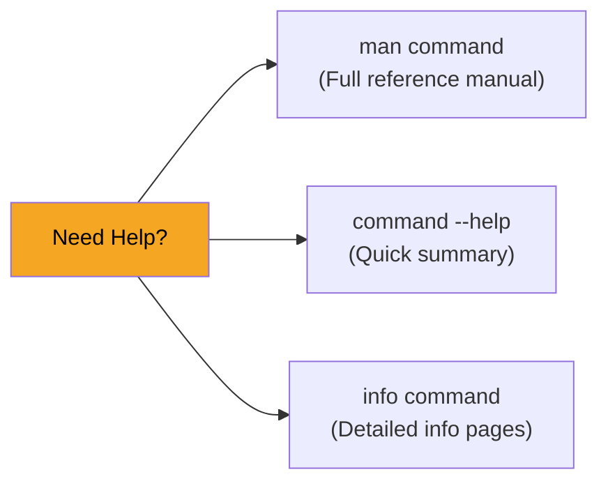
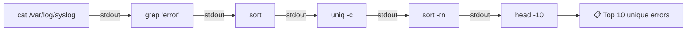

# Module 2: Command Line Administration

**Duration:** 35 minutes  
**Difficulty:** Beginner–Intermediate

---

## Learning Objectives

By the end of this module you will be able to:

- Navigate the filesystem using absolute and relative paths
- Use command history, man pages, and tab completion efficiently
- Combine commands using pipes (`|`) and redirection (`>`, `>>`, `<`)
- Search and filter text with `grep`, `find`, `sort`, `cut`, `head`, `tail`
- Build multi-command pipelines to process system data

---

## 1. Command Syntax

Every Linux command follows the same pattern:

```
command  [options]  [arguments]
   |          |          |
   |          |     Files or targets the command acts on
   |          |
   |     Flags that modify behaviour (-v, --verbose, -l)
   |
Name of the program to run
```

**Examples:**

| Command | Program | Options | Arguments |
|---------|---------|---------|-----------|
| `ls -la /etc` | `ls` | `-l -a` | `/etc` |
| `grep -r "error" /var/log/` | `grep` | `-r` | `"error" /var/log/` |
| `find /home -name "*.txt"` | `find` | `-name` | `/home "*.txt"` |

---

## 2. Navigation and Path Types

| Type | Description | Example |
|------|-------------|---------|
| **Absolute path** | Starts from `/` — always works regardless of where you are | `/etc/nginx/nginx.conf` |
| **Relative path** | Relative to your current directory | `../config/app.conf` |
| `~` | Your home directory shorthand | `~/scripts/deploy.sh` |
| `.` | Current directory | `./myscript.sh` |
| `..` | Parent directory | `cd ../..` |

---

## 3. Essential Navigation Commands

| Command | Purpose |
|---------|---------|
| `pwd` | Print working directory |
| `cd /path` | Change directory |
| `ls -la` | List all files with permissions |
| `tree -L 2` | Visual directory tree |

---

## 4. Getting Help

There are three ways to get help for any command:



| Tool | Best For |
|------|---------|
| `man ls` | Detailed reference with all options |
| `ls --help` | Quick option list |
| `info coreutils` | GNU-standard detailed documentation |
| `apropos keyword` | Search man pages by keyword |


**Pro tip:** Press `q` to quit `man`, `/` to search within a man page, and `n` to jump to the next match.


---

## 5. Pipes and Redirection

This is where the command line becomes genuinely powerful. Think of pipes as an **assembly line** — the output of one command becomes the input of the next.



**Redirection symbols:**

| Symbol | Action | Example |
|--------|--------|---------|
| `>` | Redirect stdout to file (overwrite) | `ls > files.txt` |
| `>>` | Redirect stdout to file (append) | `echo "log" >> app.log` |
| `<` | Read stdin from file | `sort < names.txt` |
| `2>` | Redirect stderr | `cmd 2> errors.log` |
| `2>&1` | Merge stderr into stdout | `cmd > all.log 2>&1` |
| `\|` | Pipe stdout to next command | `ls \| grep ".conf"` |

---

## 6. Text Processing Toolkit

| Command | Purpose | Example |
|---------|---------|---------|
| `grep pattern file` | Search for text | `grep "Failed" /var/log/auth.log` |
| `grep -r pattern dir` | Recursive search | `grep -r "listen" /etc/nginx/` |
| `find /path -name "*.conf"` | Find files by name | `find /etc -name "*.conf"` |
| `sort file` | Sort lines alphabetically | `sort names.txt` |
| `sort -n file` | Sort numerically | `sort -n sizes.txt` |
| `cut -d: -f1 file` | Extract fields | `cut -d: -f1 /etc/passwd` |
| `head -n 20 file` | First 20 lines | `head -20 /var/log/syslog` |
| `tail -n 50 file` | Last 50 lines | `tail -50 /var/log/syslog` |
| `tail -f file` | Follow live output | `tail -f /var/log/nginx/access.log` |
| `wc -l file` | Count lines | `wc -l /etc/passwd` |
| `tee file` | Write to file AND stdout | `ls \| tee listing.txt` |
| `xargs` | Build commands from stdin | `find . -name "*.bak" \| xargs rm` |
| `uniq -c` | Count duplicate lines | `sort names.txt \| uniq -c` |

---

## 🔬 Lab 2: Command Line Mastery

**Estimated time:** 25 minutes

### Objectives
- Build a working directory structure
- Navigate with absolute and relative paths
- Search and filter text from real system files
- Chain commands into pipelines
- Use history and tab completion

---

### Step 1: Create a Working Directory Structure

```terminal:execute
command: mkdir -p ~/workshop/lab2/{config,logs,scripts,backups}
```

Verify the structure:

```terminal:execute
command: tree ~/workshop/lab2
```

Expected output:
```
/home/student/workshop/lab2
├── backups
├── config
├── logs
└── scripts

4 directories, 0 files
```

---

### Step 2: Create Test Files

```terminal:execute
command: echo "server_name=webserver-01" > ~/workshop/lab2/config/app.conf
```

```terminal:execute
command: echo "port=8080" >> ~/workshop/lab2/config/app.conf
```

```terminal:execute
command: echo "debug=false" >> ~/workshop/lab2/config/app.conf
```

```terminal:execute
command: cat ~/workshop/lab2/config/app.conf
```

Expected output:
```
server_name=webserver-01
port=8080
debug=false
```

---

### Step 3: Navigate Using Relative Paths

```terminal:execute
command: cd ~/workshop/lab2/config
```

```terminal:execute
command: pwd
```

Navigate to the parent:

```terminal:execute
command: cd ..
```

Navigate to the scripts directory using a relative path:

```terminal:execute
command: cd scripts && pwd
```

Return home:

```terminal:execute
command: cd ~
```

---

### Step 4: Search the Filesystem with find

Find all `.conf` files under `/etc`:

```terminal:execute
command: find /etc -name "*.conf" -type f 2>/dev/null | head -20
```

Find files larger than 1MB under `/usr`:

```terminal:execute
command: find /usr -size +1M -type f 2>/dev/null | head -10
```

Find recently modified files (changed in last 60 minutes):

```terminal:execute
command: find /var/log -mmin -60 -type f 2>/dev/null
```


`2>/dev/null` redirects permission-denied errors to `/dev/null` (the black hole of Linux). This keeps your output clean.


---

### Step 5: Filter Logs with grep and Pipelines

Count the number of users defined in the system:

```terminal:execute
command: wc -l /etc/passwd
```

Extract only usernames (field 1, delimited by `:`):

```terminal:execute
command: cut -d: -f1 /etc/passwd
```

Find only system users (UID < 1000 — field 3):

```terminal:execute
command: awk -F: '$3 < 1000 {print $1, $3}' /etc/passwd | sort -k2 -n
```

Search for authentication events in the system log:

```terminal:execute
command: sudo grep -i "session opened" /var/log/auth.log 2>/dev/null | tail -10
```

---

### Step 6: Build a Pipeline

This pipeline finds the most common words in the system journal:

```terminal:execute
command: sudo journalctl -n 200 --no-pager 2>/dev/null | tr ' ' '\n' | sort | uniq -c | sort -rn | head -15
```

This pipeline lists the top 10 largest files in `/usr/bin`:

```terminal:execute
command: find /usr/bin -type f -exec du -h {} + 2>/dev/null | sort -rh | head -10
```

Save output to a file using `tee` (writes to both screen and file):

```terminal:execute
command: ls /etc/*.conf | tee ~/workshop/lab2/logs/etc-conf-files.txt | wc -l
```

```terminal:execute
command: cat ~/workshop/lab2/logs/etc-conf-files.txt
```

---

### Step 7: Use History and Tab Completion

View your command history:

```terminal:execute
command: history | tail -20
```

Search history with Ctrl+R (type a keyword to reverse search). In this terminal, you can also:

```terminal:execute
command: history | grep "find"
```

Run the last command again:

```terminal:execute
command: !!
```

Run a specific historical command by number (replace 42 with a real number from your history):

```terminal:execute
command: history | grep "mkdir" | head -5
```


**Tab completion tip:** Type `cat /etc/pass` then press **Tab** — it completes to `cat /etc/passwd`. If there are multiple matches, press **Tab twice** to see all options.


---

### Step 8: Read a Man Page

```terminal:execute
command: man find | head -50
```

Look up the meaning of the `find -mtime` option:

```terminal:execute
command: man find | grep -A3 "\-mtime"
```

---

## ✅ Lab 2 Verification

```examiner:execute-test
name: check-nginx-installed
title: "Verify: workshop directory structure exists"
timeout: 10
```

---

## 🏆 Challenge: Find Modified Config Files

**Task:** Find all `.conf` files under `/etc` that were modified **today**. Save the list to `~/workshop/lab2/logs/modified-today.txt`. Then count how many there are and print the count.

**Requirements:**
- Use `find` with the `-mtime 0` flag (modified within the last 24 hours)
- Use `tee` to save AND display output simultaneously
- Use `wc -l` to count results

```section:begin
title: "💡 Show Hint"
```
You need to combine three things:
1. `find` with the right flags for "modified today"
2. Redirect output to a file
3. Count the lines

The `tee` command lets you write to a file while still passing output down the pipeline.
```section:end
```

```section:begin
title: "✅ Show Solution"
```
```terminal:execute
command: find /etc -name "*.conf" -mtime 0 -type f 2>/dev/null | tee ~/workshop/lab2/logs/modified-today.txt | wc -l
```

Then view the saved list:
```terminal:execute
command: cat ~/workshop/lab2/logs/modified-today.txt
```
```section:end
```

---

## 📝 Knowledge Check

**Question 1:** What does the `|` (pipe) symbol do?

- A) Appends output to a file
- B) Sends the output of one command as input to the next
- C) Redirects stderr to stdout
- D) Compares two files

```section:begin
title: "📋 Reveal Answer"
```
**✅ B — Pipe sends stdout of left command as stdin to right command**

Pipes are the backbone of the "Unix philosophy": build small tools that do one thing well, then combine them.
```section:end
```

---

**Question 2:** What does `grep -r "error" /var/log/` do?

- A) Searches all files in /var/log for the word "error" recursively
- B) Replaces the word "error" in /var/log
- C) Deletes files containing "error"
- D) Counts lines with "error"

```section:begin
title: "📋 Reveal Answer"
```
**✅ A — Recursively searches all files in the directory**

`-r` means recursive. Without it, grep would only search one file. With a directory argument, grep searches all files within it.
```section:end
```

---

**Question 3:** What is the difference between `>` and `>>`?

- A) No difference
- B) `>` overwrites a file; `>>` appends to it
- C) `>` appends; `>>` overwrites
- D) `>` redirects stdin; `>>` redirects stdout

```section:begin
title: "📋 Reveal Answer"
```
**✅ B — `>` overwrites; `>>` appends**

Use `>` when you want a fresh file. Use `>>` when you want to add to existing content (e.g., log files).
```section:end
```

---

**Question 4:** Which command shows only the LAST 5 lines of a file?

- A) `head -5 file`
- B) `tail -5 file`
- C) `last -5 file`
- D) `bottom -5 file`

```section:begin
title: "📋 Reveal Answer"
```
**✅ B — `tail -5 file`**

`head` shows the beginning; `tail` shows the end. `tail -f` follows a file in real time — essential for watching log files.
```section:end
```

---

**Question 5:** You want to find all files named `*.log` under `/var` and delete them. Which pipeline approach is safe?

- A) `rm -rf /var/*.log`
- B) `find /var -name "*.log" | xargs rm`
- C) `find /var -name "*.log" | head -5` (then review before deleting)
- D) `grep "*.log" /var`

```section:begin
title: "📋 Reveal Answer"
```
**✅ C — Always review with head/less BEFORE piping to rm**

Option B is technically correct syntax but dangerous without review. Best practice is: `find /var -name "*.log" | head -20` first, then if the list looks right: `find /var -name "*.log" -delete`.
```section:end
```

---

## Summary

| Concept | Key Commands |
|---------|-------------|
| Navigation | `cd`, `pwd`, `ls -la`, `tree` |
| Help | `man`, `--help`, `apropos` |
| Pipes | `\|`, `tee`, `xargs` |
| Redirection | `>`, `>>`, `<`, `2>`, `2>&1` |
| Search | `grep`, `grep -r`, `find` |
| Text tools | `sort`, `cut`, `head`, `tail`, `wc`, `uniq` |
| History | `history`, `!!`, `Ctrl+R` |

---

**Next:** [Module 3: Filesystem and Storage →](03-filesystem)
