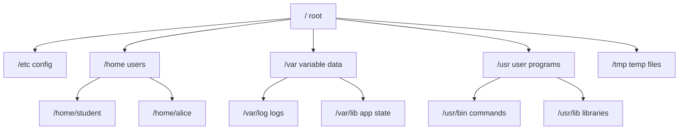
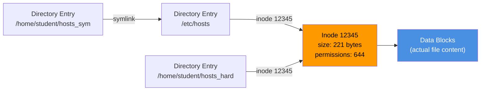

# Module 3: Filesystem and Storage

**Duration:** 30 minutes  
**Difficulty:** Beginner–Intermediate

---

## Learning Objectives

By the end of this module you will be able to:

- Describe the FHS filesystem hierarchy and common directory purposes
- Explain absolute vs relative paths
- Create and use hard links and symbolic links
- Check disk usage with `df` and `du`
- Inspect mounted filesystems and block devices
- Understand inodes and their role

---

## 1. How Linux Stores Files

Linux uses a **unified filesystem tree** — unlike Windows with separate drive letters, everything starts at `/`.



Physical devices (disks, USB drives) are **mounted** at any point in this tree. The device `/dev/sda1` might be mounted at `/`, `/dev/sdb1` at `/data`, etc.

---

## 2. Inodes — The Foundation of Linux Filesystems

Every file has an **inode** (index node) — a data structure storing file metadata:

| Inode stores | Inode does NOT store |
|-------------|---------------------|
| File size | Filename |
| Owner (UID/GID) | File contents |
| Permissions | Directory location |
| Timestamps (mtime, atime, ctime) | |
| Pointer to data blocks | |


**Key insight:** The filename is stored in a directory entry, which points to an inode. This separation enables hard links — multiple directory entries pointing to the same inode.


---

## 3. Hard Links vs Symbolic Links

Two files can "be" the same file in different ways:



| Feature | Hard Link | Symbolic Link |
|---------|-----------|--------------|
| Points to | Same inode | Path (name) of another file |
| Works across filesystems | No | Yes |
| Works for directories | No (usually) | Yes |
| Original deleted | Link still works | Link breaks (dangling) |
| Shows in `ls -l` | No `->` shown | Shows `->` target |
| Command | `ln source link` | `ln -s source link` |

---

## 4. Disk Usage Tools

| Command | Purpose | Example |
|---------|---------|---------|
| `df -h` | Disk free space per filesystem | `df -h` |
| `df -hT` | Same + filesystem type | `df -hT` |
| `du -sh /var` | Size of a directory (summary) | `du -sh /var/log` |
| `du -h --max-depth=1 /` | Size of top-level directories | |
| `lsblk` | List block devices as tree | `lsblk` |
| `lsblk -f` | Include filesystem type and UUID | `lsblk -f` |
| `findmnt` | Show mounted filesystems (tree) | `findmnt` |
| `findmnt -t ext4` | Show only ext4 mounts | |
| `mount` | Show all mounts (verbose) | `mount \| column -t` |
| `blkid` | Show device UUIDs | `sudo blkid` |

---

## 5. Key `/proc` Virtual Filesystem Files

The `/proc` filesystem is **not a real disk** — it's a window into the running kernel.

| File | Contains |
|------|---------|
| `/proc/cpuinfo` | CPU model, cores, flags |
| `/proc/meminfo` | Memory usage details |
| `/proc/mounts` | Currently mounted filesystems |
| `/proc/partitions` | Disk partitions |
| `/proc/uptime` | System uptime in seconds |
| `/proc/loadavg` | CPU load averages |

---

## 🔬 Lab 3: Filesystem Exploration

**Estimated time:** 20 minutes

---

### Step 1: Check Disk Space

See how much space each mounted filesystem uses:

```terminal:execute
command: df -hT
```

Expected output:
```
Filesystem     Type      Size  Used Avail Use% Mounted on
tmpfs          tmpfs     388M  1.1M  387M   1% /run
/dev/vda1      ext4       20G  5.2G   14G  28% /
tmpfs          tmpfs     1.9G     0  1.9G   0% /dev/shm
tmpfs          tmpfs     5.0M     0  5.0M   0% /run/lock
/dev/vda15     vfat      105M  6.1M   99M   6% /boot/efi
```


`tmpfs` is a RAM-backed filesystem — it exists only in memory and is very fast. `/run` and `/dev/shm` use tmpfs.


---

### Step 2: Find the Largest Directories

Check top-level disk usage (requires sudo for system dirs):

```terminal:execute
command: sudo du -h --max-depth=1 / 2>/dev/null | sort -rh | head -15
```

Find what's taking up space under `/var`:

```terminal:execute
command: sudo du -h --max-depth=2 /var 2>/dev/null | sort -rh | head -10
```

Check your home directory size:

```terminal:execute
command: du -sh ~/
```

---

### Step 3: Explore Block Devices

List all block devices with their partitions:

```terminal:execute
command: lsblk
```

List devices with filesystem type and UUID:

```terminal:execute
command: lsblk -f
```

Show partition table information:

```terminal:execute
command: sudo fdisk -l 2>/dev/null | head -30
```

---

### Step 4: Inspect Mounted Filesystems

Show the filesystem mount tree:

```terminal:execute
command: findmnt
```

Show only real (non-virtual) filesystems:

```terminal:execute
command: findmnt -t ext4,xfs,btrfs,vfat
```

Check `/proc/mounts` directly:

```terminal:execute
command: cat /proc/mounts | grep -v "^tmpfs\|^proc\|^sys\|^dev" | column -t
```

---

### Step 5: Create Hard Links

First create a source file:

```terminal:execute
command: echo "This is the original content" > ~/workshop/lab3/original.txt
```

```terminal:execute
command: mkdir -p ~/workshop/lab3
```

```terminal:execute
command: echo "This is the original content" > ~/workshop/lab3/original.txt
```

Create a hard link:

```terminal:execute
command: ln ~/workshop/lab3/original.txt ~/workshop/lab3/hardlink.txt
```

Check inode numbers — they should be **the same**:

```terminal:execute
command: ls -lai ~/workshop/lab3/
```

Expected output (inode numbers should match for original.txt and hardlink.txt):
```
total 16
2097153 drwxr-xr-x 2 student student 4096 Oct 10 14:23 .
2097152 drwxr-xr-x 3 student student 4096 Oct 10 14:23 ..
2097154 -rw-rw-r-- 2 student student   29 Oct 10 14:23 hardlink.txt
2097154 -rw-rw-r-- 2 student student   29 Oct 10 14:23 original.txt
```


Notice the **2** in the link count column — that means 2 directory entries point to this inode. The inode number (first column) is identical for both files.


Modify through the hard link — the original reflects the change:

```terminal:execute
command: echo "Additional line" >> ~/workshop/lab3/hardlink.txt && cat ~/workshop/lab3/original.txt
```

Delete the "original" — the hard link still works:

```terminal:execute
command: rm ~/workshop/lab3/original.txt && cat ~/workshop/lab3/hardlink.txt
```

---

### Step 6: Create Symbolic Links

Create a symlink to `/etc/hosts`:

```terminal:execute
command: ln -s /etc/hosts ~/workshop/lab3/hosts_symlink
```

List and observe the `->` arrow:

```terminal:execute
command: ls -la ~/workshop/lab3/hosts_symlink
```

Expected output:
```
lrwxrwxrwx 1 student student 10 Oct 10 14:25 /home/student/workshop/lab3/hosts_symlink -> /etc/hosts
```

The `l` at the start of permissions indicates a symlink.

Read through the symlink:

```terminal:execute
command: cat ~/workshop/lab3/hosts_symlink
```

Create a broken symlink (pointing to non-existent target):

```terminal:execute
command: ln -s /tmp/does-not-exist ~/workshop/lab3/broken_link
```

```terminal:execute
command: ls -la ~/workshop/lab3/broken_link
```

```terminal:execute
command: cat ~/workshop/lab3/broken_link 2>&1 || echo "Dangling symlink - target does not exist"
```

Find all broken symlinks in a directory:

```terminal:execute
command: find ~/workshop/lab3 -xtype l 2>/dev/null
```

---

### Step 7: Understand Inode Limits

A filesystem can run out of inodes before running out of disk space (happens with millions of small files):

```terminal:execute
command: df -i
```

The `-i` flag shows inode usage instead of block usage.

---

## 🏆 Challenge: Find the Largest Directory

**Task:** Find the **5 largest directories** under `/usr` (not files — directories only). Sort them by size, largest first.

**Requirements:**
- Do not include files, only directories
- Sort in human-readable descending order (e.g., "100M" comes before "50M")
- Show only the top 5

```section:begin
title: "💡 Show Hint"
```
- Use `du` with a flag to limit depth
- Use `sort -rh` for reverse human-readable sort
- Use `head -5` to show only 5 results
- Add `2>/dev/null` to suppress permission errors
```section:end
```

```section:begin
title: "✅ Show Solution"
```
```terminal:execute
command: sudo du -h --max-depth=3 /usr 2>/dev/null | sort -rh | grep -v "^[0-9]*\.[0-9]*[KMG].*\." | head -10
```

Simpler approach:
```terminal:execute
command: sudo du -sh /usr/*/ 2>/dev/null | sort -rh | head -5
```
```section:end
```

---

## 📝 Knowledge Check

**Question 1:** What is an inode?

- A) A type of filesystem
- B) A data structure storing file metadata (size, permissions, timestamps)
- C) A directory entry
- D) A partition table entry

```section:begin
title: "📋 Reveal Answer"
```
**✅ B — Inode stores metadata but NOT the filename or content**

The inode number is the true identifier of a file. The filename is just a directory entry that points to an inode. This is why you can have multiple filenames (hard links) for the same file.
```section:end
```

---

**Question 2:** What happens when you delete the original file that a HARD LINK points to?

- A) The hard link also becomes broken
- B) The data is deleted but the hard link file remains empty
- C) The hard link still works — the data persists until all hard links are removed
- D) The system throws an error

```section:begin
title: "📋 Reveal Answer"
```
**✅ C — Hard links prevent deletion of data**

The kernel only frees the data blocks when the inode's link count reaches 0. Deleting a filename just decrements the link count. This is why `rm` stands for "remove name" — it removes the directory entry, not necessarily the data.
```section:end
```

---

**Question 3:** Which command shows disk usage in human-readable format for each mounted filesystem?

- A) `du -h /`
- B) `df -h`
- C) `lsblk -h`
- D) `mount -h`

```section:begin
title: "📋 Reveal Answer"
```
**✅ B — `df -h` shows free/used space per mounted filesystem**

`du` shows directory/file sizes, not filesystem-level space. `lsblk` shows block device topology but not usage percentages.
```section:end
```

---

**Question 4:** A symbolic link is created to `/etc/nginx/nginx.conf`. Then `/etc/nginx/nginx.conf` is deleted. What happens to the symlink?

- A) It is also automatically deleted
- B) It points to the directory `/etc/nginx/`
- C) It becomes a dangling (broken) symlink
- D) It creates a copy of the file

```section:begin
title: "📋 Reveal Answer"
```
**✅ C — The symlink becomes dangling (broken)**

Symbolic links store the PATH to a file, not the data. If the target file disappears, the symlink points to nothing. Use `find -xtype l` to find dangling symlinks.
```section:end
```

---

**Question 5:** Which command shows the filesystem type (ext4, xfs) alongside disk usage?

- A) `df -h`
- B) `df -hT`
- C) `du -T`
- D) `lsblk -h`

```section:begin
title: "📋 Reveal Answer"
```
**✅ B — `df -hT` adds the Type column**

The `-T` flag adds a Type column showing ext4, tmpfs, vfat, etc. This is useful for quick filesystem audits.
```section:end
```

---

## Summary

| Concept | Key Takeaway |
|---------|-------------|
| Filesystem Tree | One tree from `/` — physical disks are mounted within it |
| Inode | File metadata structure — does NOT contain the filename |
| Hard Link | Second directory entry pointing to the same inode |
| Symbolic Link | A file that contains a PATH to another file |
| `df` | Disk free — shows filesystem-level space |
| `du` | Disk usage — shows directory/file sizes |
| `lsblk` | Block device tree — shows disk partitions |
| `findmnt` | Mount tree — shows where devices are mounted |

---

**Next:** [Module 4: Users, Groups and Permissions →](04-users)
