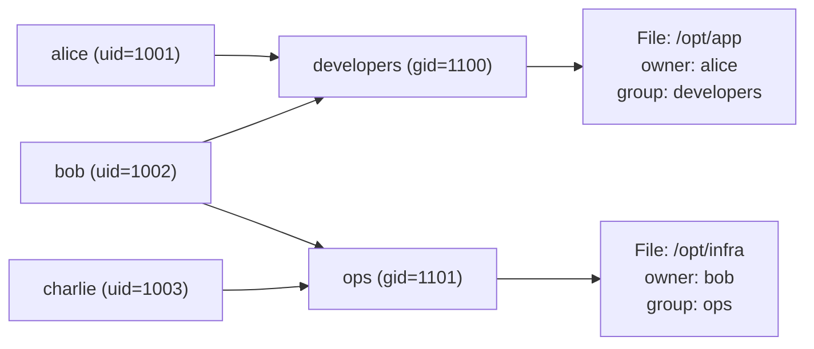

# Module 4: Users, Groups and Permissions

**Duration:** 35 minutes  
**Difficulty:** Intermediate

---

## Learning Objectives

By the end of this module you will be able to:

- Create and manage users with `useradd`, `passwd`, and `usermod`
- Create and manage groups with `groupadd` and `gpasswd`
- Set file ownership with `chown` and `chgrp`
- Configure permissions with `chmod` (symbolic and octal)
- Understand and configure `umask`
- Configure sudo access safely
- Understand SUID, SGID, and the sticky bit

---

## 1. Linux Users and Groups

Every process and file in Linux is owned by a user and a group.



| Concept | Description | File |
|---------|-------------|------|
| Users | Accounts with UID | `/etc/passwd` |
| Passwords | Hashed passwords | `/etc/shadow` |
| Groups | Collections of users | `/etc/group` |
| Group passwords | Rarely used | `/etc/gshadow` |

---

## 2. The `/etc/passwd` Format

```
username:x:UID:GID:GECOS:home_directory:login_shell
student  :x:1000:1000:Student User:/home/student:/bin/bash
```

| Field | Meaning |
|-------|---------|
| `username` | Login name |
| `x` | Password (stored in `/etc/shadow`) |
| `UID` | User ID number |
| `GID` | Primary group ID |
| `GECOS` | Full name / comment |
| `home_directory` | Home directory path |
| `login_shell` | Shell on login (`/bin/bash`, `/usr/sbin/nologin`) |

---

## 3. Linux Permission Model

Every file has three sets of permissions for three classes of user:

```
-rwxr-xr--  1  alice  developers  4096  Oct 10 12:00  script.sh
│└─────────     │      │
│  │             │      └─ Group (developers)
│  │             └─ Owner (alice)
│  └─ Permissions: rwx r-x r--
│                   ^^^  ^^^  ^^^
│                   |    |    └ Others
│                   |    └ Group
│                   └ Owner
└─ File type: - (regular), d (dir), l (link), c (char dev), b (block dev)
```

**Permission meanings:**

| Symbol | File | Directory |
|--------|------|-----------|
| `r` (4) | Read file contents | List directory contents |
| `w` (2) | Modify file | Create/delete files in dir |
| `x` (1) | Execute file | Enter (`cd`) directory |
| `-` (0) | Permission denied | Permission denied |

**Octal notation examples:**

| Octal | Symbolic | Meaning |
|-------|----------|---------|
| `755` | `rwxr-xr-x` | Owner: all; Group+Others: read+execute |
| `644` | `rw-r--r--` | Owner: read+write; Group+Others: read only |
| `600` | `rw-------` | Owner only read+write |
| `777` | `rwxrwxrwx` | Full access for everyone |
| `700` | `rwx------` | Owner only, full access |
| `664` | `rw-rw-r--` | Owner+Group: read+write; Others: read |


Never set `777` on files or directories in production. This gives EVERYONE full access, including malicious processes or users.


---

## 4. Special Permission Bits

| Bit | On Files | On Directories |
|-----|---------|----------------|
| **SUID** (4000) | Run as file owner regardless of who executes | Rarely used |
| **SGID** (2000) | Run as file's group | New files inherit directory's group |
| **Sticky** (1000) | No effect | Only file owner can delete files in dir |

- `passwd` command has SUID: `-rwsr-xr-x 1 root root /usr/bin/passwd`  
- `/tmp` has sticky bit: `drwxrwxrwt`  
- Shared team directories should use SGID: `drwxrwsr-x`

---

## 5. umask

`umask` is a **subtracted** mask applied to new file permissions.

| `umask` | New files get | New dirs get |
|---------|--------------|-------------|
| `022` (default) | `644` (666-022) | `755` (777-022) |
| `002` | `664` | `775` |
| `077` | `600` | `700` |

---

## 6. sudo Configuration

`sudo` is configured in `/etc/sudoers` (always edit with `visudo`).

```bash
# Format: WHO  WHERE=(AS_WHOM)  WHAT
student  ALL=(ALL:ALL)  ALL                  # Full sudo
alice    ALL=(ALL)  NOPASSWD: /bin/systemctl  # Specific command, no password
%developers  ALL=(ALL)  /usr/bin/apt          # Group-level access
```


NEVER edit `/etc/sudoers` directly with `vim` or `nano`. Always use `sudo visudo`. It validates syntax before saving, preventing lockouts.


---

## 🔬 Lab 4: Users, Groups and Permissions

**Estimated time:** 25 minutes

### Objectives
- Create a `developers` group
- Create two developer users
- Configure a shared directory with SGID
- Set up sudo access
- Test all permissions

---

### Step 1: Create the Developers Group

```terminal:execute
command: sudo groupadd developers
```

Verify it was created:

```terminal:execute
command: getent group developers
```

Expected output:
```
developers:x:1100:
```

---

### Step 2: Create Developer Users

Create two developer accounts:

```terminal:execute
command: sudo useradd -m -s /bin/bash -G developers -c "Developer User 1" devuser1
```

```terminal:execute
command: sudo useradd -m -s /bin/bash -G developers -c "Developer User 2" devuser2
```

Set passwords:

```terminal:execute
command: echo "devuser1:DevPass123!" | sudo chpasswd
```

```terminal:execute
command: echo "devuser2:DevPass123!" | sudo chpasswd
```

Verify both users:

```terminal:execute
command: id devuser1 && id devuser2
```

Expected output:
```
uid=1001(devuser1) gid=1001(devuser1) groups=1001(devuser1),1100(developers)
uid=1002(devuser2) gid=1002(devuser2) groups=1002(devuser2),1100(developers)
```

---

### Step 3: Inspect the User Records

View user entries in `/etc/passwd`:

```terminal:execute
command: grep "devuser" /etc/passwd
```

View group membership:

```terminal:execute
command: grep "developers" /etc/group
```

---

### Step 4: Create a Shared Directory

Create a shared project directory:

```terminal:execute
command: sudo mkdir -p /opt/devshare
```

Set ownership to root:developers:

```terminal:execute
command: sudo chown root:developers /opt/devshare
```

Set SGID + group-writable permissions (2775):

```terminal:execute
command: sudo chmod 2775 /opt/devshare
```

Verify:

```terminal:execute
command: ls -la /opt/ | grep devshare
```

Expected output:
```
drwxrwsr-x  2 root developers 4096 Oct 10 14:30 devshare
```


The `s` in `rws` means **SGID is set**. Any new file created in this directory will automatically inherit the `developers` group — perfect for team collaboration.


---

### Step 5: Test Shared Directory Permissions

Switch to devuser1 and create a file:

```terminal:execute
command: sudo -u devuser1 touch /opt/devshare/devuser1_file.txt
```

Switch to devuser2 and create another file:

```terminal:execute
command: sudo -u devuser2 touch /opt/devshare/devuser2_file.txt
```

List the directory — both files should be owned by their users but inherit the `developers` group:

```terminal:execute
command: ls -la /opt/devshare/
```

Expected output:
```
total 8
drwxrwsr-x 2 root     developers 4096 Oct 10 14:31 .
drwxr-xr-x 4 root     root       4096 Oct 10 14:30 ..
-rw-rw-r-- 1 devuser1 developers    0 Oct 10 14:31 devuser1_file.txt
-rw-rw-r-- 1 devuser2 developers    0 Oct 10 14:31 devuser2_file.txt
```

Both files inherit the `developers` group automatically — that's SGID in action.

---

### Step 6: Configure chmod

Practice changing permissions with both symbolic and octal notation:

```terminal:execute
command: touch ~/workshop/lab4/testfile.txt
```

```terminal:execute
command: mkdir -p ~/workshop/lab4 && touch ~/workshop/lab4/testfile.txt
```

Set read-only for everyone (symbolic):

```terminal:execute
command: chmod a=r ~/workshop/lab4/testfile.txt && ls -la ~/workshop/lab4/testfile.txt
```

Add execute for owner (symbolic):

```terminal:execute
command: chmod u+x ~/workshop/lab4/testfile.txt && ls -la ~/workshop/lab4/testfile.txt
```

Set `rw-r--r--` using octal:

```terminal:execute
command: chmod 644 ~/workshop/lab4/testfile.txt && ls -la ~/workshop/lab4/testfile.txt
```

Set `rwxr-xr-x` using octal:

```terminal:execute
command: chmod 755 ~/workshop/lab4/testfile.txt && ls -la ~/workshop/lab4/testfile.txt
```

---

### Step 7: Check and Set umask

View current umask:

```terminal:execute
command: umask
```

View umask in symbolic form:

```terminal:execute
command: umask -S
```

Create a file and see the default permissions applied:

```terminal:execute
command: touch ~/workshop/lab4/umask_test.txt && ls -la ~/workshop/lab4/umask_test.txt
```

Temporarily change umask and test:

```terminal:execute
command: umask 077 && touch ~/workshop/lab4/private.txt && ls -la ~/workshop/lab4/private.txt
```

Reset umask:

```terminal:execute
command: umask 022
```

---

### Step 8: Configure Sudo Access

Add `devuser1` to the sudo group:

```terminal:execute
command: sudo usermod -aG sudo devuser1
```

Verify:

```terminal:execute
command: id devuser1
```

Test sudo as devuser1:

```terminal:execute
command: sudo -u devuser1 sudo -l 2>&1 | head -10
```

---

## ✅ Lab 4 Verification

```examiner:execute-test
name: check-group-exists
title: "Verify: developers group exists"
timeout: 10
```

```examiner:execute-test
name: check-user-exists
title: "Verify: devuser1 user account exists"
timeout: 10
```

```examiner:execute-test
name: check-permissions
title: "Verify: /opt/devshare has SGID permissions"
timeout: 10
```

```examiner:execute-test
name: check-sudo-config
title: "Verify: student user has sudo access"
timeout: 10
```

---

## 🏆 Challenge: Shared Developer Workspace

**Task:** Create a fully configured shared workspace for the development team:

1. Create directory `/opt/projects`
2. Set ownership to `root:developers`
3. Set permissions so:
   - Root has full access
   - Developers can read, write, and execute (enter)
   - Others have no access at all
4. Enable SGID so new files inherit the `developers` group
5. Create a file inside as `devuser1` and verify the group inheritance

**Expected final permissions:** `drwxrws---` (mode 2770)

```section:begin
title: "💡 Show Hint"
```
- SGID on a directory is octal `2` prefix (2770)
- Use `chmod 2770` for the combined permission
- Verify with `ls -la /opt/projects`
- The `s` in `rws` confirms SGID is active
```section:end
```

```section:begin
title: "✅ Show Solution"
```
```terminal:execute
command: sudo mkdir -p /opt/projects && sudo chown root:developers /opt/projects && sudo chmod 2770 /opt/projects && ls -la /opt/ | grep projects
```

Create a test file as devuser1:
```terminal:execute
command: sudo -u devuser1 touch /opt/projects/test.py && ls -la /opt/projects/
```
```section:end
```

---

## 📝 Knowledge Check

**Question 1:** What permission mode in octal gives owner all permissions, group read+execute, and others no access?

- A) `751`
- B) `750`
- C) `710`
- D) `770`

```section:begin
title: "📋 Reveal Answer"
```
**✅ B — `750`**

- Owner: `7` = rwx (4+2+1)
- Group: `5` = r-x (4+0+1)
- Others: `0` = --- 

Mode 750 is common for shell scripts accessible to a team.
```section:end
```

---

**Question 2:** What does the SGID bit on a directory do?

- A) Makes the directory accessible only to root
- B) New files in the directory inherit the directory's group
- C) Prevents users from deleting files they don't own
- D) Runs commands as the directory owner

```section:begin
title: "📋 Reveal Answer"
```
**✅ B — New files inherit the directory's group**

SGID on directories is essential for shared team workspaces. Without it, new files would belong to the creating user's primary group, which might not be `developers`.
```section:end
```

---

**Question 3:** What is the safe way to edit `/etc/sudoers`?

- A) `vim /etc/sudoers`
- B) `nano /etc/sudoers`
- C) `sudo visudo`
- D) `sudo chmod 666 /etc/sudoers` then edit

```section:begin
title: "📋 Reveal Answer"
```
**✅ C — Always use `sudo visudo`**

`visudo` locks the file during editing and validates syntax before saving. A syntax error in sudoers can lock you out of sudo entirely. Always use `visudo`.
```section:end
```

---

**Question 4:** What does `chmod u+x script.sh` do?

- A) Removes execute permission from all users
- B) Adds execute permission for the owner (user) only
- C) Adds execute permission for everyone
- D) Sets the SUID bit

```section:begin
title: "📋 Reveal Answer"
```
**✅ B — Adds execute only for the file owner**

`u` = user (owner), `g` = group, `o` = others, `a` = all. `+` adds, `-` removes, `=` sets exactly.
```section:end
```

---

**Question 5:** User `alice` has umask `022`. She creates a file. What are its permissions?

- A) `777`
- B) `755`
- C) `644`
- D) `600`

```section:begin
title: "📋 Reveal Answer"
```
**✅ C — `644`**

Files get base permissions `666`. Apply umask `022`: 666 - 022 = 644 (`rw-r--r--`). Directories get base `777`, so 777 - 022 = 755.
```section:end
```

---

## Summary

| Task | Command |
|------|---------|
| Create user | `sudo useradd -m -s /bin/bash -G groupname username` |
| Set password | `sudo passwd username` or `echo "user:pass" \| sudo chpasswd` |
| Create group | `sudo groupadd groupname` |
| Add user to group | `sudo usermod -aG groupname username` |
| Change ownership | `sudo chown owner:group file` |
| Change permissions | `chmod 755 file` or `chmod u+x file` |
| Set SGID on dir | `chmod g+s directory` or `chmod 2775 directory` |
| Check permissions | `ls -la` |
| Check user info | `id username`, `getent passwd username` |
| Check group | `getent group groupname` |
| Edit sudoers | `sudo visudo` |

---

**Next:** [Module 5: Package Management →](05-packages)
