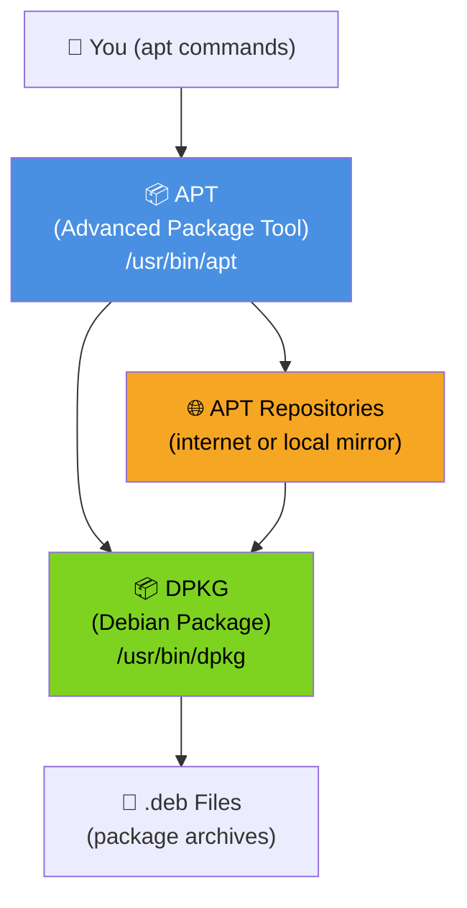
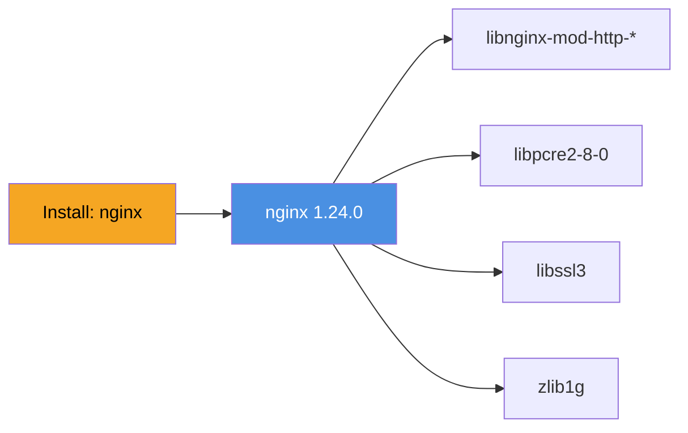

# Module 5: Package Management

**Duration:** 25 minutes  
**Difficulty:** Beginner

---

## Learning Objectives

By the end of this module you will be able to:

- Explain the difference between APT and DPKG
- Search, install, update, and remove packages using `apt`
- Inspect installed packages using `dpkg`
- Manage software repositories in `/etc/apt/sources.list`
- Understand package dependencies
- Perform a full system upgrade safely

---

## 1. Package Management Architecture

Ubuntu uses a layered package management system:



| Tool | Role | When to Use |
|------|------|-------------|
| **apt** | High-level: handles dependencies, repos, updates | Day-to-day admin |
| **apt-get** | Script-friendly version of apt (no color/progress) | Shell scripts |
| **dpkg** | Low-level: install/query/remove single .deb files | Inspecting installed packages |

---

## 2. Package Repository Configuration

APT knows where to download packages from the repository list:

```bash
# Primary sources list
cat /etc/apt/sources.list

# Additional repository files (PPAs, third-party)
ls /etc/apt/sources.list.d/
```

A repository entry looks like:
```
deb https://archive.ubuntu.com/ubuntu noble main restricted universe multiverse
     ^^^                                ^^^^^ ^^^^^^^^^^^^^^^^^^^^^^^^^^^^^^^^^^^^
     Protocol+URL                       Distro  Components
```

| Component | Contains |
|-----------|----------|
| `main` | Officially supported open-source packages |
| `restricted` | Proprietary drivers with support |
| `universe` | Community-maintained open-source |
| `multiverse` | Non-free, unsupported software |

---

## 3. APT Command Reference

| Command | Action |
|---------|--------|
| `sudo apt update` | Refresh package index from repositories |
| `sudo apt upgrade` | Upgrade all installed packages |
| `sudo apt full-upgrade` | Upgrade + handle removed/added dependencies |
| `apt search nginx` | Search for packages by keyword |
| `apt show nginx` | Show package details and dependencies |
| `sudo apt install -y nginx` | Install a package (yes to all prompts) |
| `sudo apt remove nginx` | Remove package, keep config files |
| `sudo apt purge nginx` | Remove package AND config files |
| `sudo apt autoremove` | Remove unused dependency packages |
| `apt list --installed` | List all installed packages |
| `apt list --upgradable` | List packages with available upgrades |
| `dpkg -l nginx` | Detailed package status |
| `dpkg -L nginx` | List all files installed by package |
| `dpkg -S /usr/bin/nginx` | Find which package owns a file |
| `dpkg -i package.deb` | Install a local .deb file |


Always run `sudo apt update` before installing packages. The local package index can be days or weeks old, and installing without updating may give you an outdated version.


---

## 4. Understanding Package Dependencies

APT automatically handles dependencies — when you install `nginx`, APT also installs `libnginx-mod-http-gzip-static`, `libssl3`, etc.



When you remove `nginx`, you may be left with unused dependencies. Clean them with:
```bash
sudo apt autoremove
```

---

## 🔬 Lab 5: Package Management

**Estimated time:** 20 minutes

### Objectives
- Update the package index
- Search and inspect a package
- Install nginx
- Verify installation
- Remove and reinstall nginx
- Install htop (challenge prep)

---

### Step 1: Update the Package Index

Always start here. This downloads the latest package metadata (not the packages themselves).

```terminal:execute
command: sudo apt update
```

Expected output:
```
Hit:1 https://archive.ubuntu.com/ubuntu noble InRelease
Hit:2 https://archive.ubuntu.com/ubuntu noble-updates InRelease
Hit:3 https://archive.ubuntu.com/ubuntu noble-backports InRelease
Hit:4 https://security.ubuntu.com/ubuntu noble-security InRelease
Reading package lists... Done
Building dependency tree... Done
Reading state information... Done
X packages can be upgraded. Run 'apt list --upgradable' to see them.
```

---

### Step 2: Search for a Package

Search for nginx in the package index:

```terminal:execute
command: apt search nginx 2>/dev/null | head -20
```

Get detailed information about the nginx package:

```terminal:execute
command: apt show nginx 2>/dev/null
```

Notice the output shows: version, dependencies, description, size, and the repository it comes from.

---

### Step 3: Install nginx

```terminal:execute
command: sudo apt install -y nginx
```

Watch APT resolve and install all dependencies. The `-y` flag automatically confirms all prompts.

---

### Step 4: Verify the Installation

Check the installed version:

```terminal:execute
command: nginx -v
```

Expected output:
```
nginx version: nginx/1.24.0 (Ubuntu)
```

Check package status using dpkg:

```terminal:execute
command: dpkg -l nginx
```

Expected output:
```
Desired=Unknown/Install/Remove/Purge/Hold
| Status=Not/Inst/Conf-files/Unpacked/halF-conf/Half-inst/trig-aWait/Trig-pend
|/ Err?=(none)/Reinst-required (Status,Err: uppercase=bad)
||/ Name           Version          Architecture Description
+++-==============-================-============-=================================
ii  nginx          1.24.0-2ubuntu7  amd64        small, powerful, scalable web/proxy server
```

The `ii` means: first `i` = desired state is installed; second `i` = current state is installed.

---

### Step 5: List Files Installed by nginx

See every file the package placed on your system:

```terminal:execute
command: dpkg -L nginx
```

Find the main configuration file:

```terminal:execute
command: dpkg -L nginx | grep conf
```

---

### Step 6: Find Which Package Owns a File

Find who owns `/usr/sbin/nginx`:

```terminal:execute
command: dpkg -S /usr/sbin/nginx
```

Expected output:
```
nginx: /usr/sbin/nginx
```

Find who owns `ls`:

```terminal:execute
command: dpkg -S /bin/ls
```

---

### Step 7: Remove and Reinstall nginx

Remove nginx but keep configuration files:

```terminal:execute
command: sudo apt remove nginx -y
```

Verify nginx is removed but config files remain:

```terminal:execute
command: dpkg -l nginx && ls /etc/nginx/
```

Now purge (remove package AND config files):

```terminal:execute
command: sudo apt purge nginx -y && sudo apt autoremove -y
```

Verify complete removal:

```terminal:execute
command: dpkg -l | grep nginx
```

No output means nginx is fully removed.

Reinstall it:

```terminal:execute
command: sudo apt install -y nginx
```

---

### Step 8: Check for Available Upgrades

```terminal:execute
command: apt list --upgradable 2>/dev/null
```

Check how many packages can be upgraded:

```terminal:execute
command: apt list --upgradable 2>/dev/null | wc -l
```

---

### Step 9: Explore Repository Configuration

```terminal:execute
command: cat /etc/apt/sources.list
```

See any additional repositories:

```terminal:execute
command: ls /etc/apt/sources.list.d/
```

---

## ✅ Lab 5 Verification

```examiner:execute-test
name: check-nginx-installed
title: "Verify: nginx is installed"
timeout: 15
```

---

## 🏆 Challenge: Install and Verify htop

**Task:** Install the `htop` package — an interactive process viewer (covered in Module 6). After installing it, verify it's installed in three different ways:
1. Check with `dpkg -l`
2. Locate the binary with `which`
3. Find all files it installed with `dpkg -L`

```section:begin
title: "💡 Show Hint"
```
- `htop` is in the Ubuntu `universe` component (already enabled by default)
- After installing, verify with `dpkg -l htop`, `which htop`, and `dpkg -L htop`
```section:end
```

```section:begin
title: "✅ Show Solution"
```
```terminal:execute
command: sudo apt install -y htop
```

```terminal:execute
command: dpkg -l htop
```

```terminal:execute
command: which htop
```

```terminal:execute
command: dpkg -L htop
```
```section:end
```

---

## ✅ Additional Verification

```examiner:execute-test
name: check-htop-installed
title: "Verify: htop is installed"
timeout: 15
```

---

## 📝 Knowledge Check

**Question 1:** What is the difference between `apt remove` and `apt purge`?

- A) No difference
- B) `remove` uninstalls the binary; `purge` also removes configuration files
- C) `remove` only removes docs; `purge` removes binaries
- D) `purge` is faster

```section:begin
title: "📋 Reveal Answer"
```
**✅ B — `remove` keeps config files; `purge` removes everything**

`apt remove nginx` keeps files in `/etc/nginx/`, allowing you to reinstall and keep your configuration. `apt purge nginx` deletes configuration files too.
```section:end
```

---

**Question 2:** What must you run before installing a package to ensure you get the latest version?

- A) `apt clean`
- B) `apt upgrade`
- C) `apt update`
- D) `dpkg --configure -a`

```section:begin
title: "📋 Reveal Answer"
```
**✅ C — `apt update`**

`apt update` refreshes the local package index from repositories. Without it, APT might install an outdated version or fail to find a newly added package.
```section:end
```

---

**Question 3:** Which command shows which installed package owns the file `/usr/bin/curl`?

- A) `apt show curl`
- B) `dpkg -L curl`
- C) `dpkg -S /usr/bin/curl`
- D) `which curl`

```section:begin
title: "📋 Reveal Answer"
```
**✅ C — `dpkg -S /path/to/file`**

`-S` searches for which package installed a given file. This is essential when you find an unknown binary on a system and need to know where it came from.
```section:end
```

---

**Question 4:** After removing a package, you run `apt autoremove`. What does this do?

- A) Removes the APT cache
- B) Removes packages that were automatically installed as dependencies and are no longer needed
- C) Removes all manually installed packages
- D) Restores the system to factory defaults

```section:begin
title: "📋 Reveal Answer"
```
**✅ B — Removes orphaned dependency packages**

When you install package A which depends on package B, then remove A, package B becomes "orphaned" (nothing needs it). `autoremove` cleans these up and reclaims disk space.
```section:end
```

---

**Question 5:** What does the `universe` component in Ubuntu repositories contain?

- A) Official Ubuntu packages with Canonical support
- B) Community-maintained open-source packages without official support
- C) Proprietary software
- D) Security patches only

```section:begin
title: "📋 Reveal Answer"
```
**✅ B — Community-maintained open-source packages**

`main` = Canonical supported; `universe` = community maintained; `restricted` = proprietary drivers; `multiverse` = non-free, unsupported. Most packages (like htop, git, python) are in `universe`.
```section:end
```

---

## Summary

| Task | Command |
|------|---------|
| Refresh package index | `sudo apt update` |
| Search for package | `apt search keyword` |
| Show package info | `apt show pkgname` |
| Install package | `sudo apt install -y pkgname` |
| Remove (keep config) | `sudo apt remove pkgname` |
| Remove + config | `sudo apt purge pkgname` |
| Clean orphans | `sudo apt autoremove` |
| List installed | `apt list --installed` |
| List upgradable | `apt list --upgradable` |
| Package status | `dpkg -l pkgname` |
| List package files | `dpkg -L pkgname` |
| Find package for file | `dpkg -S /path/to/file` |
| Install local .deb | `sudo dpkg -i file.deb` |

---

**Next:** [Module 6: Processes, Services and Logs →](06-processes)
