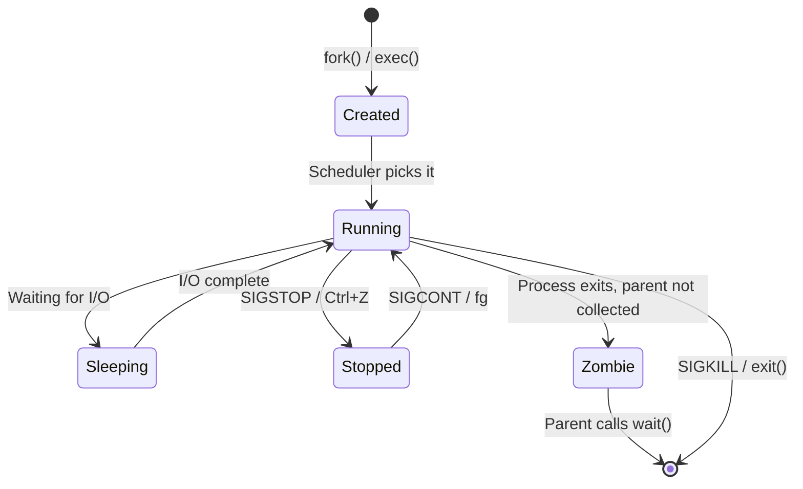
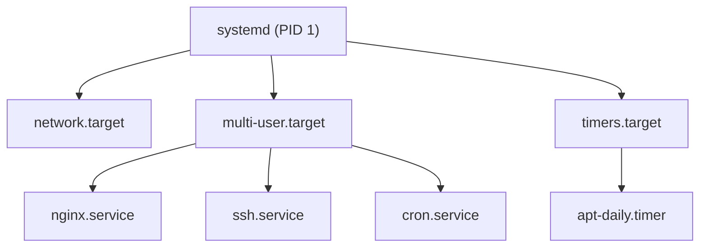

# Module 6: Processes, Services and Logs

**Duration:** 35 minutes  
**Difficulty:** Intermediate

---

## Learning Objectives

By the end of this module you will be able to:

- Explain the Linux process lifecycle
- Send signals to processes with `kill` and `pkill`
- Monitor processes with `ps`, `top`, and `htop`
- Manage background and foreground jobs with `jobs`, `fg`, `bg`
- Control services with `systemctl` (start, stop, restart, enable, disable)
- Read and filter system logs with `journalctl`
- Navigate log files in `/var/log`

---

## 1. The Linux Process Lifecycle

Every running program is a **process**. Each process has a unique PID (Process ID).



| State | Symbol | Meaning |
|-------|--------|---------|
| Running | `R` | Actively using CPU |
| Sleeping | `S` | Waiting for event (interruptible) |
| Sleeping | `D` | Uninterruptible (waiting for I/O) |
| Stopped | `T` | Paused (SIGSTOP or debugging) |
| Zombie | `Z` | Finished but parent hasn't collected it |

---

## 2. Process Signals

Signals are the OS's way of communicating with processes.

| Signal | Number | Command | Effect |
|--------|--------|---------|--------|
| `SIGHUP` | 1 | `kill -1 PID` | Reload configuration |
| `SIGINT` | 2 | `Ctrl+C` | Interrupt (polite termination) |
| `SIGQUIT` | 3 | `Ctrl+\` | Quit with core dump |
| `SIGKILL` | 9 | `kill -9 PID` | Force kill (cannot be ignored) |
| `SIGTERM` | 15 | `kill PID` | Polite termination (default) |
| `SIGSTOP` | 19 | `Ctrl+Z` | Pause process |
| `SIGCONT` | 18 | `fg` / `bg` | Resume paused process |


Always try `SIGTERM` (15) first. Only use `SIGKILL` (9) if the process doesn't respond. `SIGKILL` prevents the process from cleaning up (closing files, releasing locks).


---

## 3. systemd and Service Management

Ubuntu 24.04 uses **systemd** as its init system (PID 1). systemd manages:
- Services (long-running background processes)
- Mount points
- Timers (like cron)
- Boot target management



**Service unit file locations:**

| Path | Purpose |
|------|---------|
| `/usr/lib/systemd/system/` | Default unit files (packages install here) |
| `/etc/systemd/system/` | Admin overrides and custom units |
| `/run/systemd/system/` | Runtime (ephemeral) units |

---

## 4. systemctl Reference

| Command | Action |
|---------|--------|
| `systemctl status nginx` | Show service status and recent log |
| `sudo systemctl start nginx` | Start a service |
| `sudo systemctl stop nginx` | Stop a service |
| `sudo systemctl restart nginx` | Stop then start |
| `sudo systemctl reload nginx` | Reload config without full restart |
| `sudo systemctl enable nginx` | Enable auto-start at boot |
| `sudo systemctl disable nginx` | Disable auto-start at boot |
| `systemctl is-active nginx` | Check if service is running |
| `systemctl is-enabled nginx` | Check if service starts at boot |
| `systemctl list-units --type=service` | List all service units |
| `systemctl --failed` | Show failed services |
| `sudo systemctl daemon-reload` | Reload systemd after unit file changes |

---

## 5. journalctl — Systemd Log Viewer

`journalctl` queries the systemd journal (structured logs from all services).

| Command | What it Shows |
|---------|--------------|
| `journalctl` | All logs (oldest first) |
| `journalctl -b` | Logs since last boot |
| `journalctl -b -1` | Logs from previous boot |
| `journalctl -u nginx` | Logs for nginx service only |
| `journalctl -u nginx -n 50` | Last 50 lines for nginx |
| `journalctl -u nginx -f` | Follow nginx logs live |
| `journalctl --since "1 hour ago"` | Logs from past hour |
| `journalctl --since "2024-10-01 10:00"` | Logs since specific time |
| `journalctl -p err` | Only error level messages |
| `journalctl -p err -b` | Errors since boot |
| `sudo journalctl --disk-usage` | Show journal disk usage |

---

## 🔬 Lab 6: Processes, Services and Logs

**Estimated time:** 25 minutes

### Prerequisites

Ensure nginx is installed from Module 5:

```terminal:execute
command: which nginx || sudo apt install -y nginx
```

---

### Step 1: Explore Running Processes

View all processes (classic view):

```terminal:execute
command: ps aux | head -20
```

View process tree:

```terminal:execute
command: ps auxf | head -30
```

Find a specific process:

```terminal:execute
command: ps aux | grep nginx
```

Check systemd (PID 1):

```terminal:execute
command: ps -p 1 -o pid,ppid,comm,args
```

---

### Step 2: Monitor Processes with top

Launch top in batch mode (non-interactive for this lab):

```terminal:execute
command: top -b -n 1 | head -25
```

Key columns explained:
- `PID` — Process ID
- `USER` — Owner
- `%CPU` — CPU usage
- `%MEM` — Memory usage
- `STAT` — State (R=running, S=sleeping, Z=zombie)
- `COMMAND` — Process name


In a real terminal, `top` is interactive. Press `q` to quit, `M` to sort by memory, `P` to sort by CPU, `k` to kill a process.


If htop is installed (from Module 5 challenge):

```terminal:execute
command: which htop && htop --no-color -d 10 2>/dev/null | head -30 || echo "htop not installed - run Module 5 challenge first"
```

---

### Step 3: Start and Control nginx

Start the nginx web server:

```terminal:execute
command: sudo systemctl start nginx
```

Check its status:

```terminal:execute
command: systemctl status nginx
```

Expected output shows:
```
● nginx.service - A high performance web server and a reverse proxy server
     Loaded: loaded (/usr/lib/systemd/system/nginx.service; enabled; preset: enabled)
     Active: active (running) since ...
```

The green dot and **active (running)** confirm success.

Test that nginx responds on port 80:

```terminal:execute
command: curl -s -o /dev/null -w "%{http_code}" http://localhost
```

Expected output: `200`

---

### Step 4: Stop and Restart nginx

Stop the service:

```terminal:execute
command: sudo systemctl stop nginx
```

Verify it stopped:

```terminal:execute
command: systemctl is-active nginx
```

Expected output: `inactive`

Restart (stop + start in one command):

```terminal:execute
command: sudo systemctl restart nginx
```

Verify it's running again:

```terminal:execute
command: systemctl is-active nginx
```

Expected output: `active`

---

### Step 5: Enable nginx to Start at Boot

Currently nginx may or may not auto-start on reboot. Enable it:

```terminal:execute
command: sudo systemctl enable nginx
```

Verify boot configuration:

```terminal:execute
command: systemctl is-enabled nginx
```

Expected output: `enabled`

Now even if the system reboots, nginx will start automatically.

---

### Step 6: Read nginx Logs

View recent nginx logs using journalctl:

```terminal:execute
command: sudo journalctl -u nginx -n 30 --no-pager
```

Generate some access log entries by making requests:

```terminal:execute
command: for i in {1..5}; do curl -s http://localhost > /dev/null; done
```

View the nginx access log file directly:

```terminal:execute
command: sudo tail -10 /var/log/nginx/access.log
```

View the nginx error log:

```terminal:execute
command: sudo tail -10 /var/log/nginx/error.log
```

---

### Step 7: Explore /var/log

List the most important log files:

```terminal:execute
command: ls -lh /var/log/ | head -20
```

View recent system authentication events:

```terminal:execute
command: sudo tail -20 /var/log/auth.log
```

View kernel messages:

```terminal:execute
command: sudo dmesg | tail -20
```

View all errors since boot:

```terminal:execute
command: sudo journalctl -p err -b --no-pager | tail -20
```

---

### Step 8: Background and Foreground Jobs

Run a command in the background:

```terminal:execute
command: sleep 300 &
```

List background jobs:

```terminal:execute
command: jobs
```

Expected output:
```
[1]+  Running                 sleep 300 &
```

Bring it to the foreground:

```terminal:execute
command: fg %1
```

Stop it with Ctrl+C (or the interrupt action below):

```terminal:interrupt
session: 1
```

---

### Step 9: Deliberately Break nginx and Diagnose

Break nginx with an intentional config error:

```terminal:execute
command: sudo bash -c 'echo "INVALID CONFIGURATION LINE" >> /etc/nginx/nginx.conf'
```

Try to reload (this will fail):

```terminal:execute
command: sudo systemctl reload nginx 2>&1 || echo "nginx reload FAILED — check logs"
```

Diagnose the failure:

```terminal:execute
command: sudo journalctl -u nginx -n 20 --no-pager
```

Also check nginx's own config test:

```terminal:execute
command: sudo nginx -t 2>&1
```

Fix the broken config:

```terminal:execute
command: sudo sed -i '/INVALID CONFIGURATION LINE/d' /etc/nginx/nginx.conf
```

Verify the fix:

```terminal:execute
command: sudo nginx -t && echo "Config OK"
```

Restart nginx:

```terminal:execute
command: sudo systemctl restart nginx
```

---

## ✅ Lab 6 Verification

```examiner:execute-test
name: check-nginx-installed
title: "Verify: nginx is installed"
timeout: 10
```

```examiner:execute-test
name: check-nginx-running
title: "Verify: nginx service is active"
timeout: 15
```

---

## 🏆 Challenge: Find Why nginx Failed

**Setup:** The instructor has deliberately misconfigured nginx. Click to apply the broken config:

```terminal:execute
command: sudo bash -c 'echo "worker_processes broken_value;" >> /etc/nginx/nginx.conf' && sudo systemctl restart nginx 2>&1; echo "Setup complete - nginx may have failed"
```

**Your task:** Without looking at the solution, investigate WHY nginx failed to start and fix it.

**Tools to use:**
1. `systemctl status nginx`
2. `journalctl -u nginx -n 50`
3. `nginx -t`
4. `grep -n "broken" /etc/nginx/nginx.conf`

```section:begin
title: "💡 Show Hint"
```
The error is in `/etc/nginx/nginx.conf`. After running `nginx -t`, look at the specific line number mentioned in the error output. Then use `sed` to remove the bad line or edit it with `sudo nano /etc/nginx/nginx.conf`.
```section:end
```

```section:begin
title: "✅ Show Full Solution"
```
**Diagnose:**
```terminal:execute
command: sudo nginx -t 2>&1
```

**Identify the broken line:**
```terminal:execute
command: grep -n "broken_value" /etc/nginx/nginx.conf
```

**Fix it:**
```terminal:execute
command: sudo sed -i '/broken_value/d' /etc/nginx/nginx.conf
```

**Verify config is clean:**
```terminal:execute
command: sudo nginx -t && echo "Config is valid"
```

**Restart service:**
```terminal:execute
command: sudo systemctl restart nginx && systemctl is-active nginx
```
```section:end
```

---

## 📝 Knowledge Check

**Question 1:** What signal does `kill -9 PID` send?

- A) SIGTERM (polite shutdown)
- B) SIGHUP (reload)
- C) SIGKILL (force kill — cannot be ignored)
- D) SIGSTOP (pause)

```section:begin
title: "📋 Reveal Answer"
```
**✅ C — SIGKILL**

Signal 9 (SIGKILL) cannot be caught or ignored by the process. It's immediate termination by the kernel. Always try `kill PID` (SIGTERM=15) first to allow the process to clean up.
```section:end
```

---

**Question 2:** What is the difference between `systemctl start` and `systemctl enable`?

- A) No difference
- B) `start` starts now; `enable` makes it start at next boot
- C) `start` is permanent; `enable` is temporary
- D) `enable` requires root; `start` does not

```section:begin
title: "📋 Reveal Answer"
```
**✅ B — `start` = now; `enable` = persistent across reboots**

You typically use both: `sudo systemctl enable --now nginx` starts the service immediately AND enables it for future boots. Using `start` alone means it won't survive a reboot.
```section:end
```

---

**Question 3:** Which command shows ONLY log messages for the nginx service?

- A) `journalctl nginx`
- B) `journalctl -u nginx`
- C) `cat /var/log/nginx.log`
- D) `systemctl logs nginx`

```section:begin
title: "📋 Reveal Answer"
```
**✅ B — `journalctl -u nginx`**

The `-u` flag means "unit". This filters the journal to show only messages from the nginx systemd unit. Add `-f` to follow live, `-n 100` for last 100 lines.
```section:end
```

---

**Question 4:** A service shows status `Active: failed`. What is the first command you should run to diagnose it?

- A) `sudo systemctl restart servicename`
- B) `journalctl -u servicename -n 50`
- C) `reboot`
- D) `rm -rf /etc/servicename/`

```section:begin
title: "📋 Reveal Answer"
```
**✅ B — Check the logs first**

Never restart blindly when a service fails. Always read the logs first to understand WHY it failed. A restart might succeed temporarily but the underlying issue will cause another failure.
```section:end
```

---

**Question 5:** What does `Ctrl+Z` do to a running process in the terminal?

- A) Kills it immediately
- B) Terminates it cleanly
- C) Pauses (stops) it and sends it to the background
- D) Restarts it

```section:begin
title: "📋 Reveal Answer"
```
**✅ C — Pauses the process with SIGSTOP**

`Ctrl+Z` sends SIGSTOP, which pauses the process. It's now stopped but still exists. Use `fg` to bring it back to the foreground, `bg` to continue it in the background, or `kill %1` to terminate it.
```section:end
```

---

## Summary

| Task | Command |
|------|---------|
| List processes | `ps aux` |
| Process tree | `ps auxf` |
| Interactive monitor | `top` / `htop` |
| Find process by name | `pgrep nginx` |
| Kill by PID | `kill -15 PID` |
| Kill by name | `pkill nginx` |
| Service status | `systemctl status svcname` |
| Start service | `sudo systemctl start svcname` |
| Stop service | `sudo systemctl stop svcname` |
| Restart service | `sudo systemctl restart svcname` |
| Enable at boot | `sudo systemctl enable svcname` |
| Disable at boot | `sudo systemctl disable svcname` |
| List failed | `systemctl --failed` |
| View service logs | `journalctl -u svcname -n 50` |
| Follow logs live | `journalctl -u svcname -f` |
| Errors since boot | `journalctl -p err -b` |

---

**Next:** [Module 7: Networking →](07-networking)
