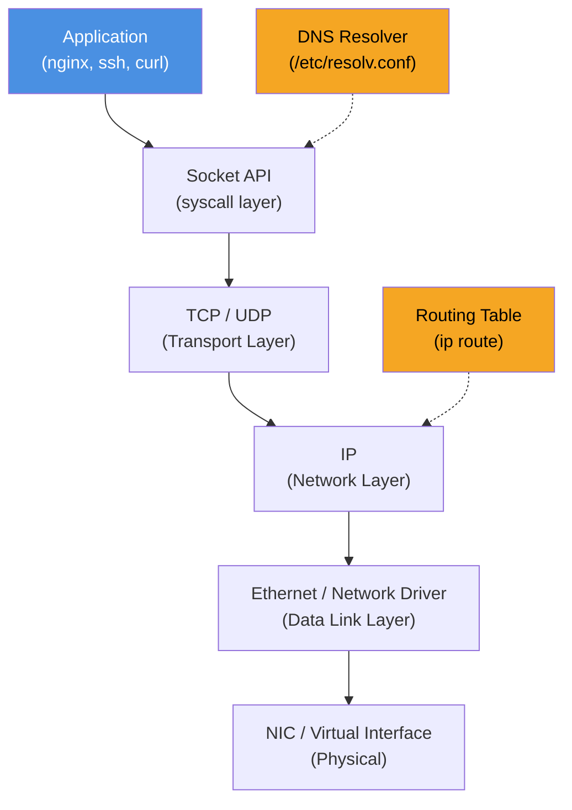
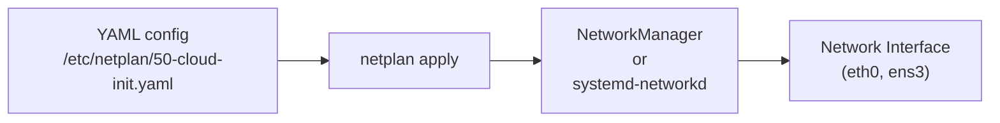
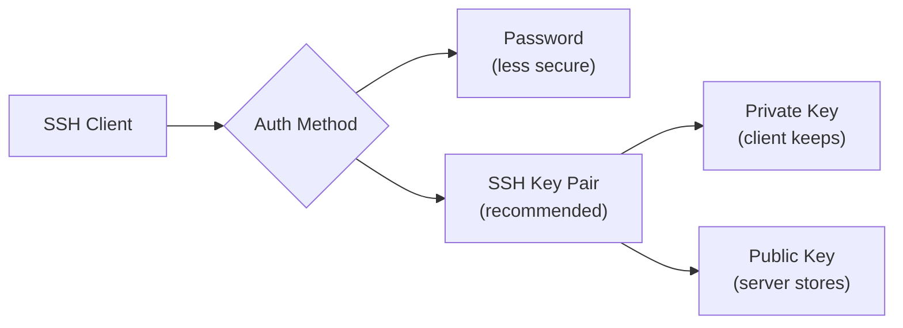

# Module 7: Networking

**Duration:** 30 minutes  
**Difficulty:** Intermediate

---

## Learning Objectives

By the end of this module you will be able to:

- Check and interpret network interface configuration with `ip`
- Verify DNS resolution using `dig`, `nslookup`, and `resolvectl`
- Inspect listening ports with `ss`
- Use `curl` and `wget` for HTTP operations
- Connect to remote systems with SSH
- Transfer files securely with `scp`
- Understand Netplan — Ubuntu's network configuration system

---

## 1. Linux Networking Overview



---

## 2. Network Interfaces

Every network connection is represented as an interface:

| Interface | Type |
|-----------|------|
| `lo` | Loopback (127.0.0.1 — points to localhost) |
| `eth0` / `ens3` | Physical or virtual Ethernet |
| `wlan0` | WiFi |
| `docker0` / `cni0` | Container bridge interfaces |

---

## 3. Key Networking Commands

| Command | Purpose |
|---------|---------|
| `ip addr show` | Show all interfaces and IP addresses |
| `ip addr show eth0` | Show specific interface |
| `ip route show` | Show routing table |
| `ip route get 8.8.8.8` | Show path to a specific IP |
| `ip link show` | Show interface state (UP/DOWN) |
| `ss -tuln` | Show listening TCP/UDP sockets |
| `ss -tnp` | Show established connections + PIDs |
| `ss -s` | Socket statistics summary |
| `ping -c 4 google.com` | Test reachability |
| `traceroute google.com` | Trace network path |
| `dig google.com` | DNS lookup (detailed) |
| `dig +short google.com` | DNS lookup (IP only) |
| `nslookup google.com` | DNS lookup (interactive) |
| `resolvectl status` | DNS resolver config |
| `cat /etc/resolv.conf` | Raw DNS config |
| `curl -I https://example.com` | HTTP headers only |
| `curl -o file.html https://example.com` | Download to file |
| `wget -O file.html https://example.com` | Download to file |

---

## 4. Netplan — Ubuntu Network Configuration

Ubuntu 24.04 uses **Netplan** to configure networking. Netplan reads YAML files in `/etc/netplan/` and generates backend configurations for NetworkManager or systemd-networkd.



A typical Netplan configuration:

```yaml
network:
  version: 2
  ethernets:
    ens3:
      dhcp4: true
      nameservers:
        addresses: [8.8.8.8, 8.8.4.4]
```

For static IP:
```yaml
network:
  version: 2
  ethernets:
    ens3:
      addresses: [192.168.1.100/24]
      routes:
        - to: default
          via: 192.168.1.1
      nameservers:
        addresses: [8.8.8.8]
```

---

## 5. SSH — Secure Shell

SSH provides encrypted remote access. The OpenSSH suite includes:

| Component | Purpose |
|-----------|---------|
| `sshd` | Server daemon (listens on port 22) |
| `ssh` | Client to connect to remote servers |
| `scp` | Secure copy over SSH |
| `ssh-keygen` | Generate key pairs |
| `ssh-copy-id` | Copy public key to remote server |

**SSH authentication methods:**



---

## 🔬 Lab 7: Networking

**Estimated time:** 20 minutes

---

### Step 1: Inspect Network Interfaces

Show all interfaces with IP addresses:

```terminal:execute
command: ip addr show
```

Look for:
- `lo` — loopback at `127.0.0.1`
- `eth0` or `ens3` — the main network interface

Show only the primary interface (likely eth0 or ens3):

```terminal:execute
command: ip addr show | grep -A4 "^[0-9]" | grep -E "^[0-9]|inet "
```

Get just your IP address:

```terminal:execute
command: ip -4 addr show | grep inet | grep -v "127.0.0.1" | awk '{print $2}'
```

---

### Step 2: Check the Routing Table

```terminal:execute
command: ip route show
```

Expected output:
```
default via 10.0.0.1 dev eth0 proto dhcp src 10.0.0.5 metric 100
10.0.0.0/24 dev eth0 proto kernel scope link src 10.0.0.5
```

See which route would be used to reach Google:

```terminal:execute
command: ip route get 8.8.8.8
```

---

### Step 3: Test Connectivity

Ping the loopback (always works):

```terminal:execute
command: ping -c 3 127.0.0.1
```

Ping external DNS (tests internet connectivity):

```terminal:execute
command: ping -c 3 8.8.8.8
```

Ping by hostname (tests DNS + connectivity):

```terminal:execute
command: ping -c 3 archive.ubuntu.com
```

---

### Step 4: DNS Resolution

Check the DNS resolver configuration:

```terminal:execute
command: cat /etc/resolv.conf
```

Resolve a hostname using dig:

```terminal:execute
command: dig archive.ubuntu.com +short
```

Get detailed DNS information:

```terminal:execute
command: dig archive.ubuntu.com
```

Check DNS resolver status:

```terminal:execute
command: resolvectl status 2>/dev/null | head -20 || systemd-resolve --status 2>/dev/null | head -20
```

Reverse DNS lookup (IP → hostname):

```terminal:execute
command: dig -x 8.8.8.8 +short
```

---

### Step 5: Inspect Listening Ports

See all listening TCP and UDP services:

```terminal:execute
command: ss -tuln
```

Expected output (with nginx running):
```
Netid  State   Recv-Q  Send-Q  Local Address:Port  Peer Address:Port
tcp    LISTEN  0       511     0.0.0.0:80           0.0.0.0:*
tcp    LISTEN  0       4096    127.0.0.1:53          0.0.0.0:*
tcp    LISTEN  0       128     0.0.0.0:22           0.0.0.0:*
```

Show established connections with process names:

```terminal:execute
command: sudo ss -tnp
```

Check specifically which process listens on port 80:

```terminal:execute
command: sudo ss -tlnp | grep :80
```

---

### Step 6: Test HTTP with curl

Fetch response headers from a URL (no body):

```terminal:execute
command: curl -I http://localhost
```

Expected output:
```
HTTP/1.1 200 OK
Server: nginx/1.24.0 (Ubuntu)
Date: Thu, 10 Oct 2024 14:00:00 GMT
Content-Type: text/html
...
```

Download a file with curl:

```terminal:execute
command: curl -s https://api.github.com/zen
```

Download with wget and save to file:

```terminal:execute
command: wget -q -O ~/workshop/lab7/ubuntu_page.html http://localhost && ls -lh ~/workshop/lab7/ubuntu_page.html
```

```terminal:execute
command: mkdir -p ~/workshop/lab7 && wget -q -O ~/workshop/lab7/ubuntu_page.html http://localhost && ls -lh ~/workshop/lab7/ubuntu_page.html
```

---

### Step 7: SSH Configuration

Check if SSH is running:

```terminal:execute
command: systemctl is-active ssh || systemctl is-active sshd
```

Check SSH listening:

```terminal:execute
command: ss -tlnp | grep :22
```

View SSH server configuration:

```terminal:execute
command: sudo cat /etc/ssh/sshd_config | grep -v "^#" | grep -v "^$"
```

---

### Step 8: SSH Key Generation

Generate an SSH key pair (for passwordless authentication):

```terminal:execute
command: ssh-keygen -t ed25519 -C "student@workshop" -f ~/.ssh/workshop_key -N "" 2>/dev/null || echo "Key already exists"
```

View the public key:

```terminal:execute
command: cat ~/.ssh/workshop_key.pub
```

---

### Step 9: SSH to Localhost

Add your public key to authorized_keys so you can SSH without a password:

```terminal:execute
command: cat ~/.ssh/workshop_key.pub >> ~/.ssh/authorized_keys && chmod 600 ~/.ssh/authorized_keys
```

SSH to localhost using the key:

```terminal:execute
command: ssh -i ~/.ssh/workshop_key -o StrictHostKeyChecking=no localhost "hostname && whoami" 2>/dev/null || echo "Note: SSH to localhost requires sshd running on port 22"
```

---

### Step 10: Transfer Files with SCP

Create a test file to transfer:

```terminal:execute
command: echo "This is a backup file from $(hostname) at $(date)" > ~/workshop/lab7/backup.txt
```

Copy the file to another location via SSH/SCP (localhost in this case):

```terminal:execute
command: scp -i ~/.ssh/workshop_key -o StrictHostKeyChecking=no ~/workshop/lab7/backup.txt localhost:/tmp/backup_transferred.txt 2>/dev/null && echo "SCP transfer successful" || echo "Note: SCP requires sshd running"
```

Verify the transfer:

```terminal:execute
command: ls -la /tmp/backup_transferred.txt 2>/dev/null && cat /tmp/backup_transferred.txt || echo "File not found - check SSH/SCP setup"
```

---

## ✅ Lab 7 Verification

```examiner:execute-test
name: check-ssh-running
title: "Verify: SSH service is running"
timeout: 15
```

---

## 🏆 Challenge: Transfer a Backup File Using SCP

**Task:** Perform a complete backup workflow:

1. Create a backup of `/etc/hosts` in `~/workshop/lab7/hosts_backup.txt`
2. Use `scp` to transfer it to `/tmp/hosts_backup_$(hostname).txt` on localhost
3. Verify the file exists and has the correct content

**Requirements:**
- Use `cp` to create the backup from `/etc/hosts`
- Use `scp` to transfer it (with key authentication)
- Use `diff` to verify the transferred file matches the original

```section:begin
title: "💡 Show Hint"
```
Steps:
1. `cp /etc/hosts ~/workshop/lab7/hosts_backup.txt`
2. `scp ~/workshop/lab7/hosts_backup.txt localhost:/tmp/hosts_backup_$(hostname).txt`
3. `diff /etc/hosts /tmp/hosts_backup_$(hostname).txt && echo "Files match"`
```section:end
```

```section:begin
title: "✅ Show Solution"
```
```terminal:execute
command: cp /etc/hosts ~/workshop/lab7/hosts_backup.txt
```

```terminal:execute
command: scp -i ~/.ssh/workshop_key -o StrictHostKeyChecking=no ~/workshop/lab7/hosts_backup.txt localhost:/tmp/hosts_backup_$(hostname).txt 2>/dev/null && echo "Transfer complete" || echo "Transferred locally: cp ~/workshop/lab7/hosts_backup.txt /tmp/hosts_backup_$(hostname).txt"
```

```terminal:execute
command: diff /etc/hosts ~/workshop/lab7/hosts_backup.txt && echo "Files match - backup is accurate"
```
```section:end
```

---

## 📝 Knowledge Check

**Question 1:** What command shows all listening TCP and UDP ports?

- A) `netstat -tuln`
- B) `ss -tuln`
- C) `ip port show`
- D) `lsof -ports`

```section:begin
title: "📋 Reveal Answer"
```
**✅ B — `ss -tuln`** (though A also works on older systems)

`ss` (socket statistics) replaces the deprecated `netstat`. `-t` = TCP, `-u` = UDP, `-l` = listening, `-n` = numeric (no DNS lookup).
```section:end
```

---

**Question 2:** What file configures DNS resolver addresses on Ubuntu 24.04?

- A) `/etc/hosts`
- B) `/etc/resolv.conf`
- C) `/etc/dns.conf`
- D) `/etc/network/interfaces`

```section:begin
title: "📋 Reveal Answer"
```
**✅ B — `/etc/resolv.conf`**

On Ubuntu with systemd-resolved, `/etc/resolv.conf` is a symlink to `/run/systemd/resolve/stub-resolv.conf`. The actual DNS config is managed via `resolvectl` or Netplan. `/etc/hosts` is for local hostname overrides, not resolver configuration.
```section:end
```

---

**Question 3:** What is the difference between `curl -I` and `curl -o`?

- A) No difference
- B) `-I` downloads only the HTTP response headers; `-o` saves the body to a file
- C) `-I` is interactive; `-o` is offline
- D) `-I` requires authentication

```section:begin
title: "📋 Reveal Answer"
```
**✅ B — `-I` = headers only (HEAD request); `-o` = save body to file**

`curl -I` sends an HTTP HEAD request which returns only headers — useful for checking if a server is responding, what software it's running, and HTTP status codes, without downloading the full page.
```section:end
```

---

**Question 4:** You want to copy the file `report.pdf` from `server01` (user: alice, port: 22) to your local `/tmp/`. Which command is correct?

- A) `scp alice@server01:~/report.pdf /tmp/`
- B) `cp alice@server01:~/report.pdf /tmp/`
- C) `ssh alice@server01 cp report.pdf /tmp/`
- D) `rsync alice@server01:/home/alice/report.pdf /tmp/`

```section:begin
title: "📋 Reveal Answer"
```
**✅ A — `scp user@host:remote_path local_path`**

`scp` syntax mirrors `cp` but with `user@host:path` for remote paths. Option D (`rsync`) would also work, but it's not listed as the standard `scp` syntax question. Both A and D are correct in practice, but A is the pure SCP answer.
```section:end
```

---

**Question 5:** In Netplan, what does setting `dhcp4: true` on an interface do?

- A) Enables IPv4 firewall
- B) Assigns a dynamic IP address via DHCP
- C) Sets a static IPv4 address
- D) Disables IPv4

```section:begin
title: "📋 Reveal Answer"
```
**✅ B — Enables DHCP to automatically assign an IPv4 address**

When `dhcp4: true`, the interface sends a DHCP request at startup and gets an IP, gateway, and DNS from the DHCP server. Most cloud VMs use this. For static IPs, set `dhcp4: false` and provide `addresses:` and `routes:`.
```section:end
```

---

## Workshop Complete!

Congratulations! You have completed all 7 modules of the Linux System Administration Fundamentals workshop.

**You now know how to:**

| Module | Skills |
|--------|--------|
| 1 | Navigate the Linux architecture, identify OS info, use sudo |
| 2 | Use the command line, pipes, redirection, grep, find |
| 3 | Manage the filesystem, links, disk usage, inodes |
| 4 | Create users, groups, configure permissions and sudo |
| 5 | Install, verify, and remove packages with APT/DPKG |
| 6 | Control services with systemctl, diagnose with journalctl |
| 7 | Configure networking, use SSH, transfer files with SCP |

---

## Summary of All Key Commands

```workshop:copy
text: |
  # Module 1 - System Info
  hostnamectl; uname -r; cat /etc/os-release; whoami; id; sudo -l

  # Module 2 - Command Line
  find /etc -name "*.conf" | grep nginx
  cat /var/log/syslog | grep error | tail -20 | sort | uniq -c

  # Module 3 - Filesystem
  df -hT; du -sh /var; lsblk; findmnt
  ln -s /etc/hosts ~/hosts_sym; ls -lai

  # Module 4 - Users & Permissions
  sudo useradd -m -s /bin/bash -G developers devuser1
  sudo groupadd developers
  sudo chmod 2775 /opt/devshare
  sudo chown root:developers /opt/devshare

  # Module 5 - Packages
  sudo apt update && sudo apt install -y nginx
  dpkg -l nginx; dpkg -L nginx; dpkg -S /usr/sbin/nginx

  # Module 6 - Services & Logs
  sudo systemctl enable --now nginx
  journalctl -u nginx -n 50 -f
  systemctl --failed

  # Module 7 - Networking
  ip addr show; ip route show
  ss -tuln; dig google.com +short
  ssh -i ~/.ssh/id_ed25519 user@server
  scp backup.txt user@server:/tmp/
```
